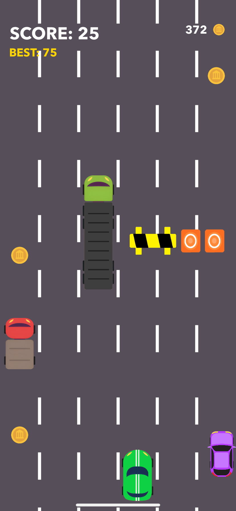

# Brakeless - iOS Arcade Game

  

## Table of Contents
- 🚀 [Project Overview](#project-overview)
- ✨ [Features](#features)
- 💻 [Technologies](#technologies)
- 📋 [Requirements](#requirements)
- 🛠️ [Setup Instructions](#setup-instructions)
- 📸 [Screenshots](#screenshots)

## Project Overview

Brakeless is a game in which the player's task is to drive a car in such a way as to avoid an incident with obstacles on the road and other traffic participants for as long as possible. The game is designed for iPhones.
> [!NOTE]  
> The game is only available in the English language version!

## Features

- 🌍 5 biomes with unique visuals
- 🚧 A lot of different obstacles, appearing differently for each biome
- 🚗 11 cars available for purchase in the store
- ⚡Upgrades possible to collect while driving
- 🔊 Unique sound atmosphere for each biome
- 📈 Difficulty level scaling with the number of points earned
- ⚙️ Ability to turn sounds and music on/off

## Technologies
- Swift programming language

## Requirements
Software versions used for development:
- Xcode 15.4+
- iOS 15+ iPhone device (the game is not designed to run on iPads)
> [!WARNING]  
> Compatibility with earlier versions has not been tested.

## Setup Instructions
(The application is not available on App Store at this time)

You will need a macOS computer with Xcode installed to run the game.

1. Download this repository.
2. Extract folder and open `Brakeless.xcodeproj` file.
3. Connect your iPhone device to Xcode.
4. Enable Developer Mode on the iPhone (`Settings > Privacy & Security`).
5. "Trust" the developer's app in the settings on the iPhone (`Settings > General > VPN & Device Management`).
6. Install and open the game.

## Screenshots
 
 
 
 
 
